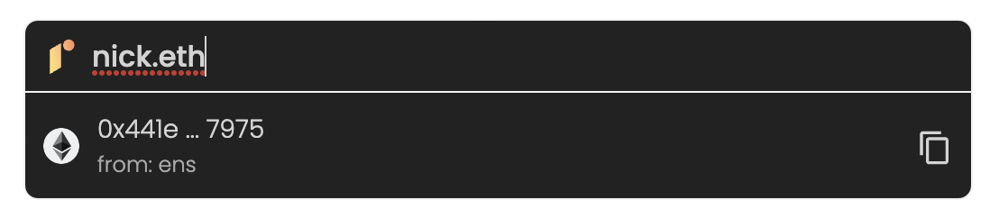

# Examples

### Demo

Try to type in some crypto names in the fields on this demo page: [https://e2xlabs.github.io/redefined-name-resolver-react/](https://e2xlabs.github.io/redefined-name-resolver-react/)

### Example of redefined name resolution

<figure><figcaption></figcaption></figure>

### Example of ENS name resolution

<figure><figcaption></figcaption></figure>

### Example of Unstoppable name resolution

<figure><figcaption></figcaption></figure>

### Example of SPACE ID name resolution

<figure><figcaption></figcaption></figure>

<figure><figcaption></figcaption></figure>

### Example of Bonfida name resolution

<figure><figcaption></figcaption></figure>

### Example of Lens name resolution

<figure><figcaption></figcaption></figure>
